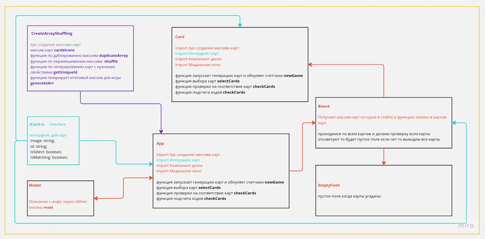

# memory-game

игра тренировка памяти

### Основной функционал приложения

- Изначально карточки повернуты рубашкой (синий с y/k).
- При нажатии на карточку показывается рисунок.
- Если 2 рисунка совпали, то эти карточки становятся неактивными и пропадают. При этом место под ними остается.
- Если 2 карточки не совпали, то эти карточки закрываются (через 1500мс).
- если до истечения 1500мс сделали третий клик, то сразу же 2 предыдущие закрываются, а новая открывается.
- При перезагрузке карты должны перемешиваться (значения карт должны быть «случайными»).
- Всего игроку доступно 40 ходов.
- Если ходы кончились, а все карточки не были отгаданы — должно появляться окно с сообщением о проигрыше.
- Если все карточки раскрыты - должно появляться окно с сообщением о выигрыше и количестве ходов, которое потребовалось, чтобы открыть все карточки.

